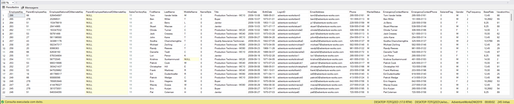

```sql
SELECT *

	

FROM [dbo].[DimEmployee]

WHERE HireDate BETWEEN '2008/01/01' AND '2010/01/01'
ORDER BY HireDate DESC

```



---

## 🛠️ Análise Passo a Passo do Código

A estrutura do script utiliza conceitos essenciais para a manipulação de campos do tipo `DATE`:

### 1. Seleção Geral (`SELECT *` e `FROM`)

* `SELECT *`: Seleciona todas as colunas da tabela de destino. No caso da `DimEmployee`, o banco retornará informações como nome do funcionário, cargo (`Title`), departamento, e-mail e dados contratuais.
* `FROM [dbo].[DimEmployee]`: Especifica a tabela dimensão que armazena o histórico de dados dos colaboradores.

### 2. O Operador `BETWEEN ... AND`

A cláusula `WHERE` utiliza o operador `BETWEEN` (que significa "entre") para delimitar o intervalo de tempo:

```sql
WHERE HireDate BETWEEN '2008/01/01' AND '2010/01/01'

```

* **Inclusividade:** É muito importante lembrar que o `BETWEEN` é **inclusivo**. Isso significa que se um funcionário tiver sido contratado exatamente no dia `2008/01/01` ou no dia `2010/01/01`, ele será incluído no resultado.
* **Formato de Data:** A consulta utiliza o padrão internacional `AAAA/MM/DD` (Ano/Mês/Dia), que é amplamente aceito e evita conflitos de interpretação dependendo do idioma configurado no servidor SQL Server.

### 3. Ordenação Cronológica Reversa (`ORDER BY ... DESC`)

```sql
ORDER BY HireDate DESC

```

* `ORDER BY HireDate`: Organiza o resultado com base na data de contratação.
* `DESC`: Altera a ordenação padrão para decrescente. Dessa forma, os funcionários contratados em 2010 aparecerão no topo do relatório, enquanto os contratados no início de 2008 aparecerão nas últimas linhas.

---

## 📝 Resumo dos Conceitos Técnicos

| Comando / Operador | Tipo | Função na Query |
| --- | --- | --- |
| `[dbo].[DimEmployee]` | Tabela Dimensão | Entidade do banco de dados que guarda os registros dos funcionários. |
| `HireDate` | Atributo / Coluna | Campo do tipo data que registra o dia de admissão do colaborador. |
| `BETWEEN` | Operador de Intervalo | Filtra valores que estão dentro de um limite inicial e final (inclusivo). |
| `AND` | Conector Lógico | Separa o valor mínimo do valor máximo exigido pelo `BETWEEN`. |
| `DESC` | Modificador de Ordem | Organiza os registros da data mais recente para a mais antiga. |

---

## 💡 Boa Prática com Datas e Horários (Horas Ocultas)

> [!WARNING]
> Tenha muito cuidado ao usar o `BETWEEN` se a coluna do seu banco de dados for do tipo `DATETIME` (que guarda data e hora) em vez de apenas `DATE`.
> Se um funcionário foi contratado no dia `2010/01/01` às **14:30**, a string `'2010/01/01'` na query é lida implicitamente pelo banco como `2010/01/01 00:00:00`. Como 14h30 é maior do que meia-noite, **esse funcionário ficaria de fora do seu relatório**. Em colunas com hora incluída, prefira usar operadores de comparação explícitos: `WHERE HireDate >= '2008/01/01' AND HireDate < '2010/01/02'`.


```

```
## ✍️ Autor

**Jailson Carvalho**  
*Profissional de Dados & Desenvolvedor SQL*

Conecte-se comigo ou tire suas dúvidas:

* **LinkedIn:** [Acessar Perfil](https://www.linkedin.com/in/jailson-carvalho-b50a223a7/)
* **WhatsApp:** [Enviar Mensagem](https://wa.me/5551996235278)
```
