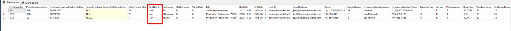

# 🔍 Filtros de Texto Avançados com o Operador LIKE em SQL

Em análise de dados, muitas vezes precisamos buscar registros textuais sem saber a grafia exata de uma palavra, ou quando queremos encontrar padrões específicos — como nomes que começam com certas letras, terminam com determinados sufixos ou possuem um comprimento fixo. 

Este artigo explora o poder do operador `LIKE` e de seus caracteres curinga (`%` e `_`) utilizando como base a tabela `DimEmployee` do banco de dados **AdventureWorks**.
```
```
## 💻 A Consulta SQL

O script abaixo demonstra diferentes abordagens de filtros de texto (com algumas opções documentadas em comentários) e executa uma busca refinada combinando o sinal de porcentagem e o underline.

```sql
SELECT *
FROM DimEmployee
-- WHERE FirstName LIKE 'AND%' --COMEÇA COM AND
-- WHERE FirstName LIKE '%NA' --TERMINA COM NA
-- WHERE FirstName LIKE '%JA%' -- EM ALGUM LUGAR NO MEIO DO NOME
WHERE FirstName LIKE '%JA_' -- O UNDERLINE PODE SER QUALQUER CARACTER
ORDER BY FirstName;

```

---

## 🛠️ Análise Passo a Passo do Código

A cláusula `LIKE` utiliza "caracteres curinga" para mapear padrões de texto. Vamos analisar o que cada opção do script faz:

### 1. Entendendo os Curingas Comentados (`--`)

As linhas iniciadas com `--` servem como um excelente guia de estudo sobre o comportamento do símbolo de porcentagem (`%`), que representa **zero ou mais caracteres**:

* `'AND%'`: Busca nomes que **começam** exatamente com "AND" (ex: *Andrew*, *Andrea*).
* `'%NA'`: Busca nomes que **terminam** exatamente com "NA" (ex: *Diana*, *Regina*).
* `'%JA%'`: Busca a sequência "JA" em **qualquer posição** do texto (ex: *Jason*, *Benjamim*, *Anja*).

### 2. O Filtro Ativo: Misturando `%` e `_` (Underline)

A linha que realmente é executada pelo banco de dados introduz um curinga diferente:

```sql
WHERE FirstName LIKE '%JA_'

```

* **O Underline (`_`)**: Ao contrário da porcentagem, o underline representa **exatamente um único caractere** obrigatório.
* **A combinação `%JA_**`: Esta instrução diz ao banco de dados: *"Traga qualquer nome que contenha a sílba 'JA', desde que ela esteja posicionada exatamente como as **penúltimas** letras do nome"*.

**Exemplos de correspondência:**

* *Ja**m**es* (Não bate, há mais de uma letra após o 'JA').
* *An**jas*** (Bate, termina com 'JA' + uma letra).

### 3. Organização (`ORDER BY`)

* `ORDER BY FirstName`: Classifica os funcionários retornados em ordem alfabética crescente (A-Z) baseando-se no primeiro nome, padronizando a exibição do relatório.

---

## 📝 Resumo dos Caracteres Curinga do LIKE

| Curinga | Significado | Exemplo Prático |
| --- | --- | --- |
| `%` | Zero, um ou múltiplos caracteres quaisquer. | `LIKE 'J%'` (João, José, Jonathan) |
| `_` | Exatamente um caractere qualquer. | `LIKE 'J_n'` (Jon, Jan) |
| `[]` | Qualquer caractere único dentro do intervalo especificado. | `LIKE '[A-C]%'` (Nomes começando com A, B ou C) |
| `[^]` | Qualquer caractere único **fora** do intervalo especificado. | `LIKE '[^A]%'` (Nomes que **não** começam com A) |

---

## 💡 Dica de Performance (Performance Tip)

> [!WARNING]
> O operador `LIKE` é extremamente útil, mas filtros que iniciam com o caractere de porcentagem (como `LIKE '%JA_'` ou `LIKE '%NA'`) impedem que o banco de dados utilize os **Índices (Indexes)** de texto de forma eficiente. Isso força o SQL Server a fazer uma varredura completa na tabela (*Table Scan*), o que pode deixar a consulta lenta em tabelas com milhões de linhas. Sempre que puder, tente iniciar o filtro com caracteres fixos (ex: `LIKE 'JA%'`).

---

## ✍️ Autor

**Jailson Carvalho** *Profissional de Dados & Desenvolvedor SQL*

Conecte-se comigo ou tire suas dúvidas:

* **LinkedIn:** [Acessar Perfil](https://www.linkedin.com/in/jailson-carvalho-b50a223a7/)
* **WhatsApp:** [Enviar Mensagem](https://www.google.com/search?q=https://wa.me/5551996235278)

```

```
